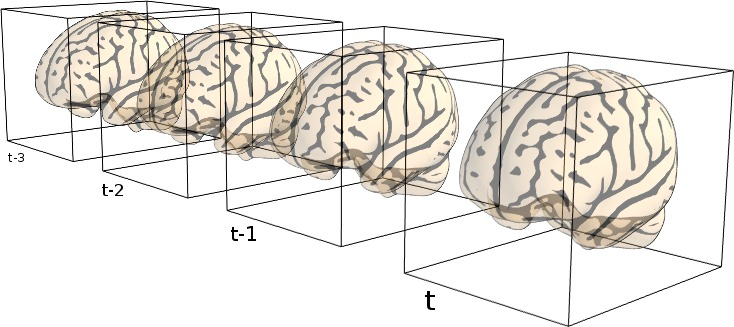
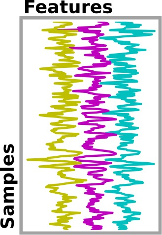

.. _manual_pipeline:

============================================================
Building your own neuroimaging machine-learning pipeline
============================================================

Nilearn comes with code to simplify the use of scikit-learn when dealing
with neuroimaging data. For the moment, nilearn is focused on functional MRI
data.

Before using a machine learning tool, we may need to apply the following
steps:

    1. :ref:`data_loading` : load Nifti files and check consistency of data
    2. :ref:`Masking data <masking>` : if a mask is not provided, one is
       computed automatically
    3. :ref:`resampling`: optionally data could be resampled to a
       different resolution
    4. :ref:`temporal_filtering`: detrending, regressing out confounds,
       normalization

.. _data_loading:

Data loading and preprocessing
===============================

Downloading the data
----------------------

To run demos, data are retrieved using a function provided by nilearn
which downloads a dataset and returns a bunch of paths to the dataset
files (more details in :ref:`loading_data`). We can then proceed
loading them as if they were just any other files on our disk. For
example, we can download the data from the
`Haxby 2001 paper <http://dx.doi.org/10.1126/science.1063736>`_ ::

    >>> from nilearn import datasets
    >>> dataset = datasets.fetch_haxby() # doctest: +SKIP

`dataset.func` contains filenames referring to dataset files on the disk::

  >>> list(sorted(dataset.keys())) # doctest: +SKIP
  ['anat', 'description', 'func', 'mask', 'mask_face', 'mask_face_little', 'mask_house', 'mask_house_little', 'mask_vt', 'session_target']
  >>> dataset.func # doctest: +ELLIPSIS +SKIP
  ['.../haxby2001/subj2/bold.nii.gz']

Access supplementary information on the dataset:

  >>> print(haxby_dataset['description']) # doctest: +SKIP

The complete list of the data-downloading functions can be found in the
:ref:`reference documentation for the datasets <datasets_ref>`.

Loading non image data: experiment description
-----------------------------------------------

An experiment may need additional information about subjects, sessions or
experiments. In the Haxby experiment, fMRI data are acquired while
presenting different category of pictures to the subject (face, cat, ...)
and the goal of this experiment is to predict which category is presented
to the subjects from the brain activation.

These conditions are presented as string into a CSV file. The `pandas 
<http://pandas.pydata.org/>`__ function
`read_csv` is very useful to load this kind of data.

.. literalinclude:: ../../examples/plot_decoding_tutorial.py
    :start-after: # We use pandas to load them in an array.
    :end-before: ###########################################################################

.. seealso::

   * `pandas <http://pandas.pydata.org/>`_ is a very useful Python
     library to load CSV files and process their data

For example, we will now consider only the conditions *cat* and *face* from our dataset.
This can be done as follows:

.. literalinclude:: ../../examples/plot_decoding_tutorial.py
    :start-after: # mask of the samples belonging to the condition.
    :end-before: ###########################################################################

.. note::

    If you are not comfortable with this kind of data processing, do not
    worry: there are plenty of examples in nilearn that allows you to easily
    load data from provided datasets. Do not hesitate to copy/paste the
    code and adapt it to your own data format if needed. More information
    can be found in the :ref:`data manipulation <data_manipulation>`
    section.

.. _masking:

Masking the data: from 4D image to 2D array
---------------------------------------------

While functional neuroimaging data consist in 4D images, positioned in a
coordinate space (which we will call :ref:`Niimgs <niimg>`). For use with
the scikit-learn, they need to be converted into 2D arrays of
samples and features.

.. |arrow| raw:: html

   &rarr;

.. centered:: |niimgs|  |arrow|  |arrays|

.. currentmodule:: nilearn.input_data

We use masking to convert 4D data (i.e. 3D volume over time) into 2D data
(i.e. voxels over time). For this purpose, we use the
:class:`NiftiMasker` object, a very powerful data loading tool.

Applying a mask
................

.. figure:: ../auto_examples/images/sphx_glr_plot_decoding_tutorial_002.png
    :target: ../auto_examples/plot_decoding_tutorial.html
    :align: right
    :scale: 30%

If your dataset provides a mask, the :class:`NiftiMasker` can apply it
automatically. All you have to do is to pass your mask as a parameter when
creating your masker. Here we use the mask of the ventral stream,
provided with the Haxby dataset.

The :class:`NiftiMasker` can be seen as a *tube* that transforms data
from 4D images to 2D arrays, but first it needs to 'fit' this data in
order to learn simple parameters from it, such as its shape:

.. literalinclude:: ../../examples/plot_decoding_tutorial.py
    :start-after: # Now we use the NiftiMasker.
    :end-before: ###########################################################################

Note that you can call `nifti_masker.transform(dataset.func[1])` on new
data to mask it in a similar way as the data that was used during the
fit.

Automatically computing a mask
...............................

If your dataset does not provide a mask, the Nifti masker will compute
one for you in the `fit` step. The generated mask can be accessed via the
`mask_img_` attribute.

Detailed information on automatic mask computation can be found in:
:ref:`extracting_data`.

Applying a scikit-learn machine learning method
================================================

Now that we have a 2D array, we can apply any estimator from the
scikit-learn, using its `fit`, `predict` or `transform` methods.

Here, we use scikit-learn Support Vector Classification to learn how to
predict the category of picture seen by the subject:

.. literalinclude:: ../../examples/plot_decoding_tutorial.py
    :start-after: # We first fit it on the data
    :end-before: # Let's measure the error rate:

We will not detail it here since there is a very good documentation about it in the
`scikit-learn documentation <http://scikit-learn.org/stable/modules/svm.html#classification>`__

Unmasking (inverse_transform)
=============================

Unmasking data is as easy as masking it! This can be done by using
method `inverse_transform` on your processed data. As you may want to
unmask several kinds of data (not only the data that you previously
masked but also the results of an algorithm), the masker is clever and
can take data of dimension 1D (resp. 2D) to convert it back to 3D
(resp. 4D).

.. literalinclude:: ../../examples/plot_decoding_tutorial.py
    :start-after: # For this, we can call inverse_transform on the NiftiMasker:
    :end-before: ###########################################################################

Here we want to see the discriminating weights of some voxels.

Visualizing results
===================

Again the visualization code is simple. We can use an fMRI slice as a
background and plot the weights. Brighter points have a higher
discriminating weight.

.. literalinclude:: ../../examples/plot_decoding_tutorial.py
    :start-after: # We can plot the weights, using the subject's anatomical as a background
    :end-before: ###########################################################################
.. figure:: ../auto_examples/images/sphx_glr_plot_decoding_tutorial_002.png
    :target: ../auto_examples/plot_decoding_tutorial.html
    :align: center
    :scale: 50%

Going further
=============

.. currentmodule:: nilearn.input_data

The :class:`NiftiMasker` is a very powerful object and we have only
scratched the surface of its possibilities. It is described in more
details in the section :ref:`nifti_masker`. Also, simple functions that
can be used to perform elementary operations such as masking or filtering
are described in :ref:`preprocessing_functions`.
