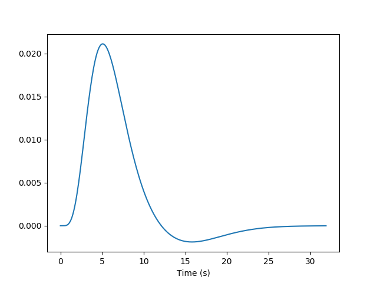

.. _glm_intro:

====================================================
An introduction to GLMs in fMRI statistical analysis
====================================================

.. contents:: **Contents**
    :local:
    :depth: 1

A primer on BOLD-fMRI data analysis
===================================

What is fMRI ?
--------------

Functional magnetic resonance imaging (fMRI) is based on the fact that when local neural activity increases, increases in metabolism and blood flow lead to fluctuations of the relative concentrations of oxyhaemoglobin (the red cells in the blood that carry oxygen) and deoxyhaemoglobin (the same red cells after they have delivered the oxygen). Oxyhaemoglobin and deoxyhaemoglobin have different magnetic properties (diamagnetic and paramagnetic, respectively), and they affect the local magnetic field in different ways. The signal picked up by the MRI scanner is sensitive to these modifications of the local magnetic field. To record cerebral activity during functional sessions, the scanner is tuned to detect this "Blood Oxygen Level Dependent" (BOLD) signal.

Brain activity is measured in sessions that span several minutes, during which the participant performs some cognitive task and the scanner acquires brain images, typically every 2 or 3 seconds (the time between two successive image acquisition is called the Repetition time, or TR).

A cerebral MR image provides a 3D image of the brain that can be decomposed into `voxels`_ (the equivalent of pixels, but in 3 dimensions). The series of images acquired during a functional session provides, in each voxel, a time series of positive real number representing the MRI signal, sampled at the TR.

.. _voxels: https://en.wikipedia.org/wiki/Voxel

.. note::

  Before fMRI images can be used to do meaningful comparisons, they must be processed to ensure that the voxels that are being compared represent the same brain regions, irrespective of the variability in size and shape of the brain and its microarchitecture across different subjects in the experiment. The process is called spatial registration or spatial normalization. During this procedure, the voxels of all the brain images are 'registered' to correspond to the same region of the brain. Usually, the images (their voxels) are registered to a standard 'template' brain image (its voxels). One often used standard template is the MNI152 template from the Montreal Neurological Institute. Once this is done, the coordinates of a voxel are in the same space as the template and can be used to estimate its brain location using brain atlases based on that same template. As previously mentioned, the nilearn package does not perform spatial preprocessing; it only does statistical analyses on the voxel time series. For preprocessing functions, users are referred to `Nipype <https://nipype.readthedocs.io/en/latest/>`_ or `fMRIPrep <https://fmriprep.readthedocs.io/en/stable/>`_.

fMRI data modelling
-------------------

One way to analyze times series consists in comparing them to a *model* built from our knowledge of the events that occurred during the functional session. Events can correspond to actions of the participant (e.g. button presses), presentations of sensory stimui (e.g. sound, images), or hypothesized internal processes (e.g. memorization of a stimulus), ...

  .. figure:: ../images/stimulation-time-diagram.png

One expects that a brain region involved in the processing of a certain type of event (e.g. the auditory cortex for sounds) would show a time course of activation that correlates with the time-diagram of these events. If the fMRI signal directly showed neural activity and did not contain any noise, we could just look at it in various voxels and detect those that conform to the time-diagrams.

But we know from previous measurements that the BOLD signal does not follow the exact time course of stimulus processing and the underlying neural activity. The BOLD response reflects changes in blood flow and concentrations in oxy-deoxy haemoglobin, all together forming a `haemodynamic response`_ which is sluggish and long-lasting, as can be seen in the following figure showing the response to an impulsive event (for example, an auditory click played to the participants).

Using our knowledge of the haemodynamic response, we can build a predicted time course from the time-diagram of the event (the operation is known as  `convolution`_; simply stated, it measures how the shape of one function's plot affects the shape of another function's plot. **Remark:** it assumes linearity of the BOLD response, an assumption that may be wrong in some scenarios). It is this predicted time course, also known as a *predictor*, that is compared to the actual fMRI signal. If the correlation between the predictor and the signal is higher than expected by chance, the voxel is said to exhibit a significant response to the event type.

.. _haemodynamic response: https://en.wikipedia.org/wiki/Haemodynamic_response
.. _convolution: https://en.wikipedia.org/wiki/Convolution

.. figure:: ../images/time-course-and-model-fit-in-a-voxel.png

Correlations are computed separately at each voxel and a correlation map can be produced displaying  the values of correlations (real numbers between -1 and +1) at each voxel. Generally, however, the maps presented in the papers report the significance of the correlations at each voxel, using T, Z or p values for the null hypothesis test of no correlation (see below). For example, the following figure displays a Z-map showing voxels responding to auditory events. Large (positive or negative) values are unlikely to be due to chance alone. The map is thresholded so that only voxels with a p-value less than 1/1000 are coloured.

.. note::

    In this approach, hypothesis tests are conducted in parallel at many voxels, increasing the liklelihood of False Positives. This is known as the Problem of `Multiple Comparisons`_. Some common strategies for dealing with this are discussed later in this page. This issue can be addressed in nilearn using permutations tests.

.. figure:: ../images/example-spmZ_map.png

In most fMRI experiments, several predictors are needed to fully describe the events occurring during the session -- for example, the experimenter may want to distinguish brain activities linked to the perception of auditory stimuli and to button presses. To find the effect specific to each predictor, a multiple  `linear regression`_ approach is typically used: all predictors are entered as columns in a *design matrix* and the software finds the linear combination of these columns that best fits the signal. The weights assigned to each predictor by this linear combination are estimates of the contribution of this predictor to the response in the voxel. One can plot this using effect size maps or, maps showing their statistical significance (how unlikely they are under the null hypothesis of no effect).

.. _linear regression: https://en.wikipedia.org/wiki/Linear_regression

In brief, the analysis of fMRI images involves:

1. Describing the paradigm in terms of events grouped by type, occurring at certain times and having specific durations.
2. Creating predictors for each type of event, typically using a convolution by the haemodynamic response.
3. Assembling these predictors in a design matrix, providing a *linear model*.
4. Estimating the parameters of the model, i.e., the weights associated with each predictor at each voxel, using linear regression.
5. Displaying the coefficients or their linear combination, and/or their statistical significance.

fMRI statistical analysis
-------------------------

As explained in the previous section, the basic statistical analysis of fMRI is conceptually a correlation analysis, where one identifies whether a certain combination (contrast) of columns of the design matrix fits a significant proportion of the fMRI signal at a given location.

It can be shown that this is equivalent to studying whether the estimated contrast effect is large with respect to the uncertainty about its exact value. Concretely, we compute the effect size estimate and the uncertainty about its value and divide the two. The resulting number has no physical dimension, it is a statistic -- a Student or t-statistic, which we denote by `t`. Next, based on `t`, we want to decide whether the true effect was indeed greater than zero or not.

`t` would not necessarily be 0 if the true effect were zero: by chance, noise in the data may be partly explained by the contrast of interest. However, if we assume that the noise is Gaussian and that the model is correctly specified, then we know that `t` should follow a Student distribution with `dof` degrees of freedom, where `dof` is the number of free parameters in the model: in practice, the number of observations (i.e. the number of time points), `n_scans` minus the number of effects modelled (i.e. the number of columns `n_columns`) of the design matrix:

 :math:`dof = n\_scans - n\_columns`

With this we can do statistical inference. Given a pre-defined error rate :math:`\alpha`, we compare the observed `t` to the :math:`(1-\alpha)` quantile of the Student distribution with `dof` degrees of freedom. If `t` is greater than this number we can reject the null hypothesis with a *p-value* :math:`\alpha`; meaning, if there were no effect, the probability of observing an effect as large as `t` would be less than :math:`\alpha`.

  .. figure:: ../images/student.png

.. note::

  A frequent misconception consists in interpreting :math:`1- \alpha` as the probability that there is indeed an effect: this is not true! Here we rely on a frequentist approach, that does not support Bayesian interpretation. See e.g. https://en.wikipedia.org/wiki/Frequentist_inference

.. note::

  It is cumbersome to work with Student distributions, since these always require to specify the degrees of freedom. To avoid this, we can transform `t` to another variable `z` such that comparing `t` to the Student distribution with `dof` degrees of freedom is equivalent to comparing `z` to a standard normal distribution. We call this the z-transform of `t`. We call the :math:`(1-\alpha)` quantile of the normal distribution the *threshold*, since we use this value to declare voxels active or not.

.. _Multiple comparisons:

Multiple Comparisons
--------------------

A well-known issue that arises here is that of multiple comparisons:
 when a statistical tests is repeated a large number times, say one for each voxel, i.e. `n_voxels` times, then one can expect that, in the absence of any effect, the number of detections -- false detections since there is no effect -- will be roughly :math:`n\_voxels*\alpha`. If :math:`\alpha=.001` and :math:`n=10^5`, the number of false detections will be about 100. The danger is that one may no longer trust the detections, i.e. values of `z` larger than the :math:`(1-\alpha)`-quantile of the standard normal distribution.

The first idea that one might think of is to take a much smaller :math:`\alpha`: for instance, if we take, :math:`\alpha=\frac{0.05}{n\_voxels}` then the expected number of false discoveries is only about 0.05, meaning that there is a 5% chance that a truly inactive voxel is declared active. This correction on the significance is known as Bonferroni procedure. It is fairly accurate when the different tests are independent or close to independent, but becomes conservative if not. The problem with this approach is that a truly activate voxel may not surpass the corresponding threshold, which is typically very high because `n_voxels` is large.

A second possibility is to choose a threshold so that the proportion of true discoveries among the discoveries reaches a certain proportion `0<q<1`; typically `q=0.05`. This means that after statistical inference, one can trust the proportionate `1-q` of the discoveries made. The number `q` is the expected proportion of false discoveries and is known as the *false discovery rate*. Controlling the false discovery rate is a reasonable compromise in practice. The thresholding that yields this level of control is typically obtained using the so-called `Benjamini-Hochberg <http://www.math.tau.ac.il/~ybenja/MyPapers/benjamini_hochberg1995.pdf>`_ procedure.

.. note::

  Note that `q` (as well as `\alpha`) are *arbitrary*. It is recommended to not rely on low values, otherwise the inference is meaningless. Ideally one should use :math:`\alpha=\frac{0.05}{n\_voxels}`, or `q=0.05`.

Note also that supra-threshold sets of voxels are often gathered into connected components (aka *clusters*), so that only large connected components are retained and isolated supra-threshold voxels are discarded. The rationale is that isolated voxels are unlikely to represent extended brain areas, and are most likely noise. Hence, discarding them most often improves the quality and the reliability of the results.
