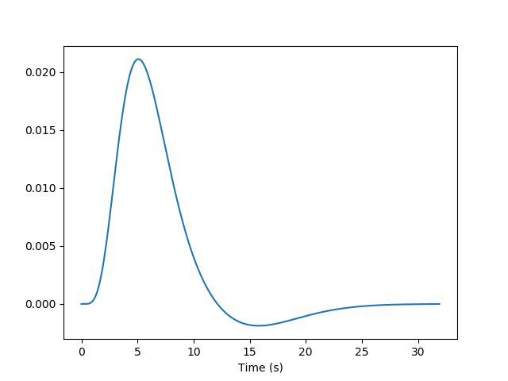

=====================================
Introduction: nistats in a nutshell
=====================================

.. contents:: **Contents**
    :local:
    :depth: 1

What is nistats?
===========================================================================

.. topic:: **What is nistats?**

   Nistats is a Python module to perform voxel-wise analyses of functional magnetic resonance images (fMRI) using linear models. It provides functions to create design matrices, at the subject and group levels, to estimate them from images series and to compute statistical maps (contrasts). It allows to perform the same statistical analyses as `a SPM`_ or `a FSL`_ (but it does not provide tools for preprocessing stages (realignment, spatial normalization, etc.); for this, see `a nipype`_.

.. _a SPM: https://www.fil.ion.ucl.ac.uk/spm/

.. _a FSL: https://www.fmrib.ox.ac.uk/fsl

.. _a nipype: https://nipype.readthedocs.io/en/latest/

A primer on BOLD-fMRI data analysis
===================================

Functional magnetic resonance imaging (fMRI) is based on the fact that when local neural activity increases, increases in metabolism and blood flow lead to fluctuations of the relative concentrations of oxyhemoglobin (the red cells in the blood that carry oxygen) and deoxyhemoglobin (the same red cells after they have delivered the oxygen). Because oxy- and deoxy-hemoglobin have different magnetic properties (one is diamagnetic while the other is paramagnetic), they affect the local magnetic field in different ways. The signal picked up by the MRI scanner is sensitive to these modifications of the local magnetic field. To record cerebral activity, during functional sessions, the scanner is tuned to detect this "Blood Oxygen Level Dependent" (BOLD) signal.

Brain activity is measured in sessions that span several minutes, while the participant performs some a cognitive task and the scanner acquires brain images, typically every 2 or 3 seconds (the time between two successive image acquisition is called the Repetition time, or TR).

A cerebral MR image provides a 3D image of the brain that can be decomposed into `a voxels`_ (the equivalent of pixels, but in 3 dimensions). The series of images acquired during a functional session provides, in each voxel, a time series of positive real number representing the MRI signal, sampled at the TR.

.. _a voxels: https://en.wikipedia.org/wiki/Voxel

.. note:: A typical step in the preprocessing of MR images, involves spatially morphing these images onto a standard template (e.g. the MNI152 template from the Montreal Neurological Institute). One this is done, the coordinates of a voxel are in the same space as the template and can be used to estimate its brain location using brain atlases. As already mentioned, the nistats package is not meant to perform spatial preprocessing, but only statistical analyses on the voxel times series, regardless of the coordinate system. 

One way to analyze times series consists in comparing them to a *model* built from our knowledge of the events that occurred during the functional session. Events can correspond to actions of the participant (e.g. button presses), presentations of sensory stimui (e.g. sound, images), or hypothesized internal processes (e.g. memorization of a stimulus), ...

.. figure:: images/stimulation-time-diagram.png

One expects that a brain region involved in the processing of a certain type of event (e.g. the auditory cortex for sounds), would show a time course of activation that correlates with the time-diagram of these events. If the fMRI signal directly showed neural activity and did not contain any noise, we could just look at it in various voxel and detect those that conform to the time-diagrams.

Yet, we know, from previous measurements, that the BOLD signal does not follow the exact time course of stimulus processing and the underlying neural activity. The BOLD response reflects changes in blood flow and concentrations in oxy-deoxy hemoglobin, all together forming an  `a haemodynamic response`_ which is sluggish and long-lasting, as can be seen on the following figure showing the response to an impulsive event (for example, an auditory click played to the participants).  

From the knowledge of the impulse haemodynamic response, we can build a predicted time course from the time-diagram of a type of event (The operation is known a  convolution. Remark: it assumes linearity of the BOLD response, an assumption that may be wrong in some scenarios). It is this predicted time course, also known as a *predictor*, that is compared to the actual fMRI signal. If the correlation between the predictor and the signal is higher than expected by chance, the voxel is said to exhibit a significant response to the event type. 

.. _a haemodynamic response: https://en.wikipedia.org/wiki/Haemodynamic_response

.. figure:: images/time-course-and-model-fit-in-a-voxel.png

Correlations are computed separately at each voxel and a correlation map can be produced displaying  the values of correlations (real numbers between -1 and +1) at each voxel. Generally, however, the maps presented in the papers report the significance of the correlations at each voxel, in forms of T, Z or p values for the null hypothesis test of no correlation. For example, the following figure displays a Z-map showing voxels responding to auditory events. Large (positive or negative) Z values are unlikely to be due to chance alone. The map is tresholded so that only voxels with a p-value less than 1/1000 are coloured. 

.. note::
    Because, in this approach, hypothesis tests are conducted in parallel at many voxels, the likelihood of making false alarms is important. This is known as the problem of multiple comparisons. It is beyond the scope of this short notice to explain ways in which this problem can be approached. Let us just mention that this issue can be addressed in nistats by using random permutations tests.

.. figure:: images/example-spmZ_map.png

In most fMRI experiments, several predictors are needed to fullly describe the  events occuring during the session -- for example, the experimenter may want to distinguish brain activities linked to the perception of auditory stimuli or to button presses. To find the effect specific to each predictor, a multiple  `linear regression`_ approach is typically used: all predictors are entered as columns in a *design-matrix* and the software finds the linear combination of these columns that best fits the signal.  The weights assigned to each predictor by this linear combination are estimates of the contribution of this predictor to the response in the voxel. One can plot this effect size maps or, maps showing their statistical significance (how unlikely they are under the null hypothesis of no effect).

.. _a linear regression: https://en.wikipedia.org/wiki/Linear_regression

In brief, the analysis of fMRI images involves:

1. describing the paradigm in terms of events of various types occuring at certain times and having some durations.
2. from this description, creating predictors for each type of event, typically using a convolution by the impulse haemodynamic response.
3. assembling these predictors in a design-matrix, providing a *linear model*
4. estimate the parameters of the model, that is, the weights associated with each predictors at each voxel, using linear regression.
5. display the coefficients, or linear combination of them, and/or their statistical significance. 

Tutorials
=========

    For tutorials, please check out the `Examples <auto_examples/index.html>`_ gallery

.. _installation:

Installing nistats
====================

.. raw:: html
   :file: install_doc_component.html
