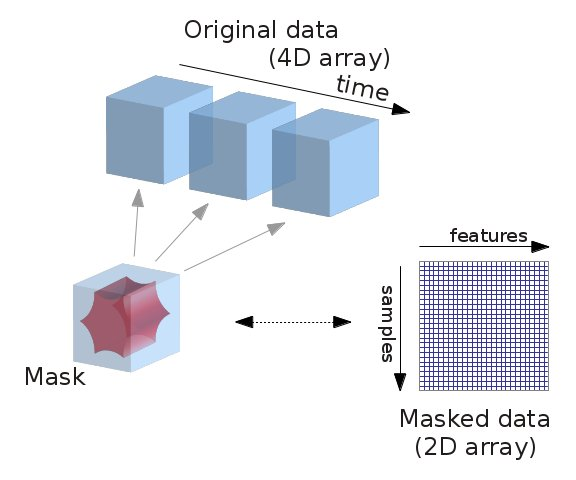

.. _data_manipulation:

=====================================================================
Manipulating images: resampling, smoothing, masking, ROIs...
=====================================================================

This chapter discusses how nilearn can be used to do simple operations on
brain images.

.. contents:: **Chapters contents**
    :local:
    :depth: 1

.. _preprocessing_functions:

Functions for data preparation and image transformation
=========================================================

Nilearn comes with many simple functions for simple data preparation and
transformation. Note that if you want to perform these operations while
loading the data into a data matrix, most are also integrated in the
:ref:`masker objects <masker_objects>`.

.. currentmodule:: nilearn

* Computing the mean of images (along the time/4th dimension):
  :func:`nilearn.image.mean_img`
* Applying numpy functions on an image or a list of images:
  :func:`nilearn.image.math_img`
* Swapping voxels of both hemisphere (e.g., useful to homogenize masks
  inter-hemispherically):
  :func:`nilearn.image.swap_img_hemispheres`
* Smoothing: :func:`nilearn.image.smooth_img`
* Cleaning signals (e.g., linear detrending, standardization,
  confound removal, low/high pass filtering):
  :func:`nilearn.image.clean_img`
  
  .. seealso::
     
     To apply this cleaning on signal matrices rather than images:
     :func:`nilearn.signal.clean`

.. _resampling:

Resampling images
=================

Resampling one image to match another one
------------------------------------------

:func:`nilearn.image.resample_to_img` resamples an image to a reference
image.

.. topic:: **Example**

    * :ref:`sphx_glr_auto_examples_04_manipulating_images_plot_resample_to_template.py`

.. image:: ../auto_examples/04_manipulating_images/images/sphx_glr_plot_resample_to_template_001.png
    :target: ../auto_examples/04_manipulating_images/plot_resample_to_template.html
    :width: 45%
.. image:: ../auto_examples/04_manipulating_images/images/sphx_glr_plot_resample_to_template_002.png
    :target: ../auto_examples/04_manipulating_images/plot_resample_to_template.html
    :width: 45%

This can be useful to display two images as overlays in some
viewers (e.g., FSLView) that require all images to be on the same grid.

Resampling to a specific target affine, shape, or resolution
-------------------------------------------------------------

:func:`nilearn.image.resample_img` specifies the resampling in terms of
the `target_affine` to match the spatial configuration defined by the new
affine.

Additionally, a `target_shape` can be used to resize images
(i.e., cropping or padding with zeros) to match an expected data
image dimensions (shape composed of x, y, and z).

Resampling can be useful to downsample images to increase processing
speed and lower memory consumption.

On an advanced note, automatic computation of offset and bounding box
can be performed by specifying a 3x3 matrix instead of the 4x4 affine.
In this case, nilearn computes automatically the translation part
of the transformation matrix (i.e., affine).

.. image:: ../auto_examples/04_manipulating_images/images/sphx_glr_plot_affine_transformation_002.png
    :target: ../auto_examples/04_manipulating_images/plot_affine_transformation.html
    :width: 30%
.. image:: ../auto_examples/04_manipulating_images/images/sphx_glr_plot_affine_transformation_004.png
    :target: ../auto_examples/04_manipulating_images/plot_affine_transformation.html
    :width: 30%
.. image:: ../auto_examples/04_manipulating_images/images/sphx_glr_plot_affine_transformation_003.png
    :target: ../auto_examples/04_manipulating_images/plot_affine_transformation.html
    :width: 30%

.. topic:: **Special case: resampling to a given voxel size**

   Specifying a 3x3 matrix that is diagonal as a target_affine fixes the
   voxel size. For instance to resample to 3x3x3 mm voxels::

    >>> import numpy as np
    >>> target_affine = np.diag((3, 3, 3))

.. seealso::

  :ref:`An example illustrating affine transforms on data and bounding boxes <sphx_glr_auto_examples_04_manipulating_images_plot_affine_transformation.py>`

Accessing individual volumes in 4D images
===========================================

* :func:`nilearn.image.index_img`: selects one or more volumes in a 4D
  image.

* :func:`nilearn.image.iter_img`: loops over all the volumes of a 4D
  image.

.. seealso::

   * :func:`nilearn.image.concat_imgs`: merge multiple 3D (or 4D) images
     into one 4D image by concatenation along the 4th (time) axis

   * :func:`nilearn.image.load_img`: load an image into memory. The
     benefit of this function is that it will convert various
     representations, such as filename, list of filenames, wildcards,
     list of in-memory objects, to an in-memory NiftiImage.

   * :func:`nilearn.image.new_img_like`: given data in a numpy array,
     creates a new image using an existing reference image for the
     metadata.

|

.. topic:: **Examples**

   * :ref:`sphx_glr_auto_examples_plot_3d_and_4d_niimg.py`

   * :ref:`sphx_glr_auto_examples_01_plotting_plot_overlay.py`

Computing and applying spatial masks
=====================================

Relevant functions:

* compute a mask from EPI images: :func:`nilearn.masking.compute_epi_mask`
* compute a mask from images with a flat background:
  :func:`nilearn.masking.compute_background_mask`
* compute for multiple sessions/subjects:
  :func:`nilearn.masking.compute_multi_epi_mask`
  :func:`nilearn.masking.compute_multi_background_mask`
* apply: :func:`nilearn.masking.apply_mask`
* intersect several masks (useful for multi sessions/subjects): :func:`nilearn.masking.intersect_masks`
* unmasking: :func:`nilearn.masking.unmask`

Extracting a brain mask
------------------------

If we do not have a spatial mask of the target regions, a brain mask
can be computed from the data:

- :func:`nilearn.masking.compute_background_mask` for brain images where
  the brain stands out of a constant background. This is typically the
  case when working on statistic maps output after a brain extraction
- :func:`nilearn.masking.compute_epi_mask` for EPI images

.. figure:: ../auto_examples/01_plotting/images/sphx_glr_plot_visualization_002.png
    :target: ../auto_examples/01_plotting/plot_visualization.html
    :align: right
    :scale: 50%

.. literalinclude:: ../../examples/01_plotting/plot_visualization.py
     :start-after: # Extracting a brain mask
     :end-before: # Applying the mask to extract the corresponding time series

.. _mask_4d_2_3d:

Masking data: from 4D Nifti images to 2D data arrays
---------------------------------------------------------------

fMRI data is usually represented as a 4D block of data: 3 spatial
dimensions and one time dimension. In practice, we are usually
interested in working on the voxel time-series in the
brain. It is thus convenient to apply a brain mask in order to convert the
4D brain images representation into a restructured 2D data representation,
`voxel` **x** `time`, as depicted below:

Note that in an analysis pipeline, this operation is best done using the
:ref:`masker objects <masker_objects>`. For completness, we give code to
do it manually below:

.. literalinclude:: ../../examples/01_plotting/plot_visualization.py
     :start-after: # Applying the mask to extract the corresponding time series

.. figure:: ../auto_examples/01_plotting/images/sphx_glr_plot_visualization_003.png
    :target: ../auto_examples/01_plotting/plot_visualization.html
    :align: center
    :scale: 40

Image operations: creating a ROI mask manually
===============================================

A region of interest (ROI) mask can be computed for instance with a
statistical test. This requires a chain of image
operations on the input data. Here is a possible recipe for computing an
ROI mask:

 * **Smoothing**: Before a statistical test, it is often use to smooth a bit
   the image using :func:`nilearn.image.smooth_img`, typically fwhm=6 for
   fMRI.

 * **Selecting voxels**: Given the smoothed data, we can select voxels
   with a statistical test (eg opposing face and house experimental
   conditions), for instance with a simple Student's t-test using scipy
   function :func:`scipy.stats.ttest_ind`.

 * **Thresholding**: Then we need threshold the statistical map to have
   better representation of voxels of interest.

 * **Mask intersection and dilation**: Post-processing the results with
   simple morphological operations, mask intersection and dilation. 

   * we can use another mask, such as a grey-matter mask, to select
     only the voxels which are common in both masks.

   * we can do `morphological dilation
     <http://en.wikipedia.org/wiki/Dilation_(morphology)>`_ to achieve
     more compact blobs with more regular boundaries. The function is
     used from :func:`scipy.ndimage.binary_dilation`.

 * **Extracting connected components**: We end with splitting the connected
   ROIs into two separate regions (ROIs), one in each hemisphere. The
   function :func:`scipy.ndimage.label` from the scipy library is used.

 * **Saving the result**: The final voxel mask is saved to disk using
   the 'to_filename' method of the image object.
   (or **nibabel.save**).

.. seealso::

   For extracting connected components:

   * A function :func:`nilearn.regions.connected_regions` can be used readily
     on probabilistic atlas Nifti-like images whereas

   * A function :func:`nilearn.regions.connected_label_regions` can be used on
     atlases denoted as labels. For instance, atlases labelled using KMeans.

.. _nibabel: http://nipy.sourceforge.net/nibabel/

.. topic:: **Code**

    A complete script of above steps with full description can be found :ref:`here
    <sphx_glr_auto_examples_04_manipulating_images_plot_roi_extraction.py>`.

.. seealso::

     * :ref:`Automatic region extraction on 4D atlas images
       <sphx_glr_auto_examples_04_manipulating_images_plot_extract_rois_smith_atlas.py>`.
