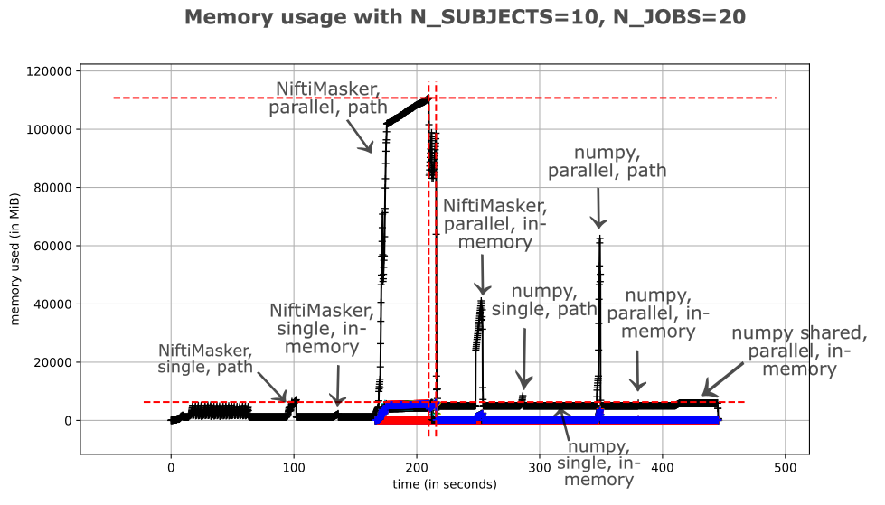

.. _masker_memory_usage:

============================================================================
Beyond the masker: masking larger images, in parallel but memory-efficiently
============================================================================

This chapter discusses a parallelized workflow which can be pretty
memory-intensive when using the masker objects.

Problem
===========

Particularly, we will consider a case where we have a large fMRI image
and we want to extract the data from several regions of interest (ROIs) defined
by a number of binary masks, all in parallel.

The issue when trying to process a large fMRI image in parallel like this is
that each parallel process will load the entire fMRI image into memory. This
can lead to a significant increase in memory usage and can slow down the
processing.

Experiment
==========

So we will try to do exactly what we just described: extract data from several
regions of interest (ROIs) defined by a number of binary masks,
all in parallel. But we will compare three different ways of doing this:

1. Using the :class:`~nilearn.maskers.NiftiMasker`
2. Using numpy indexing
3. Using numpy indexing with shared memory

For first two of these methods, we can provide fMRI image via a file path or
an in-memory image. So we will also compare the memory usage of these two
variations for those methods.

Method
======

We will use `memory_profiler
<https://github.com/pythonprofilers/memory_profiler>`_'s command-line tool
``mprof`` to measure the memory of the whole script.

.. code-block:: bash

        mprof run --include-children --multiprocess script.py

After it has finished running, you can generate a plot showing the memory
usage of the script over time.

.. code-block:: bash

        mprof plot

To resolve the memory usage peaks for each method, we will add 30 second sleep
between each method. This will allow us to see the memory usage of each method
separately in the plot.

Here's the script we will use:

.. code-block:: python

        # script.py
        import time
        from multiprocessing.shared_memory import SharedMemory
        from pathlib import Path

        import numpy as np
        from joblib import Parallel, delayed
        import nibabel as nib

        from nilearn.datasets import fetch_atlas_difumo, fetch_development_fmri
        from nilearn.image import (
            concat_imgs,
            index_img,
            iter_img,
            load_img,
            resample_to_img,
        )
        from nilearn.maskers import NiftiMasker
        from memory_profiler import memory_usage
        import matplotlib.pyplot as plt

        def get_fmri_path(n_subjects=1):
            fmri_data = fetch_development_fmri(n_subjects=n_subjects)
            concat = concat_imgs(fmri_data.func)
            Path("temp").mkdir(parents=True, exist_ok=True)
            fmri_path = Path("temp", "fmri.nii.gz")
            concat.to_filename(fmri_path)
            return concat, fmri_path

        def get_atlas_path():
            atlas = fetch_atlas_difumo(dimension=64)
            atlas_path = atlas.maps
            return atlas_path

        def atlas_to_masks(atlas_path, fmri_path, n_regions=6):
            masks = load_img(atlas_path)
            # only keep the first 6 regions
            masks = index_img(masks, slice(0, n_regions))
            mask_paths = []
            resampled_masks = []
            Path("temp").mkdir(parents=True, exist_ok=True)
            for i, mask in enumerate(iter_img(masks)):
                resampled_mask = resample_to_img(
                    mask,
                    fmri_path,
                    interpolation="nearest",
                    copy_header=True,
                    force_resample=True,
                )
                path = Path("temp", f"mask_{i}.nii.gz")
                data = resampled_mask.get_fdata()
                data[data != 0] = 1
                resampled_mask = resampled_mask.__class__(
                    data, resampled_mask.affine, resampled_mask.header
                )
                resampled_mask.to_filename(path)
                mask_paths.append(path)
                resampled_masks.append(resampled_mask)
            return resampled_masks, mask_paths

        def nifti_masker_single(fmri_path, mask_path):
            return NiftiMasker(mask_img=mask_path).fit_transform(fmri_path)

        def numpy_masker_single_path(fmri_path, mask_path):
            return np.asarray(nib.load(fmri_path).dataobj)[
                np.asarray(nib.load(mask_path).dataobj).astype(bool)
            ]

        def numpy_masker_single_inmemory(fmri_img, mask_img):
            return np.asarray(fmri_img.dataobj)[
                np.asarray(mask_img.dataobj).astype(bool)
            ]

        def numpy_masker_shared_single(img, mask):
            return img[np.asarray(mask.dataobj).astype(bool)]

        def nifti_masker_parallel(fmri_path, mask_paths, n_regions=6):
            return Parallel(n_jobs=n_regions)(
                delayed(nifti_masker_single)(fmri_path, mask) for mask in mask_paths
            )

        def numpy_masker_parallel_path(fmri_path, mask_paths, n_regions=6):
            return Parallel(n_jobs=n_regions)(
                delayed(numpy_masker_single_path)(fmri_path, mask)
                for mask in mask_paths
            )

        def numpy_masker_parallel_inmemory(fmri_img, mask_imgs, n_regions=6):
            return Parallel(n_jobs=n_regions)(
                delayed(numpy_masker_single_inmemory)(fmri_img, mask)
                for mask in mask_imgs
            )

        def numpy_masker_shared_parallel(img, masks, n_regions=6):
            return Parallel(n_jobs=n_regions)(
                delayed(numpy_masker_shared_single)(img, mask) for mask in masks
            )

        def plot_memory_usage(usage, peak_usage, n_subjects, n_regions, wait_time):

            # get zero time
            zero_time = usage[0][1]
            # subtract zero time from all timestamps and convert to dict
            usage = {time - zero_time: mem for mem, time in usage}

            fig, ax = plt.subplots(figsize=(10, 6))
            # plot memory usage over time
            ax.plot(usage.keys(), usage.values())
            ax.set_xlabel("Time (s)")
            ax.set_ylabel("Memory (MiB)")
            ax.set_title(
                f"Memory usage over time with N_SUBJECTS={n_subjects},"
                f" N_REGIONS={n_regions}"
            )

            # use order of max usage and time to calculate offset for annotations
            xoffset = np.array(list(usage.keys())).max() * 0.001
            yoffset = np.array(list(usage.values())).max() * 0.01

            # add annotations on each peak
            for peak in peak_usage:
                if isinstance(peak_usage[peak], dict):
                    for sub_peak in peak_usage[peak]:
                        if sub_peak == "single":
                            continue
                        for sub_sub_peak in peak_usage[peak][sub_peak]:
                            peak_time = (
                                peak_usage[peak][sub_peak][sub_sub_peak][1] - zero_time
                            )
                            peak_mem = peak_usage[peak][sub_peak][sub_sub_peak][0]
                            ax.annotate(
                                f"{peak_mem:.2f}"
                                f" MiB\n{peak},\n{sub_peak},\n{sub_sub_peak}",
                                xy=(peak_time, peak_mem),
                                xytext=(peak_time - xoffset, peak_mem + yoffset),
                            )
                else:
                    peak_time = peak_usage[peak][1] - zero_time
                    peak_mem = peak_usage[peak][0]

                    ax.annotate(
                        f"{peak_mem:.2f} MiB\n" f"numpy_masker,\nparallel,\nshared",
                        xy=(peak_time, peak_mem),
                        xytext=(
                            peak_time - xoffset,
                            peak_mem + yoffset,
                        ),
                    )

            # increase the y-axis limit by 20% to make the plot more readable
            ax.set_ylim(ax.get_ylim()[0], ax.get_ylim()[1] * 1.2)
            plt.savefig(
                f"memory_usage_n{n_subjects}_j{n_regions}.png", bbox_inches="tight"
            )
            plt.close()

        def main(n_images=1, n_regions=6, wait_time=30):
            """
            Compare the performance of NiftiMasker vs. numpy masking vs.
            numpy masking + shared memory both with single and
            `n_regions` parallel processes.

            The first two methods can be used with either file paths
            or in-memory images. So we also compare their memory usage.

            We add `wait_time` between each method to see the memory usage
            of each method separately in the plot.

            Steps:

            1. fetch `n_images` subjects from development fMRI dataset and
            `n_regions` regions from the Difumo atlas.
            2. convert these regions to binary masks and resample them to the
            fMRI data.
            3. run the following methods in sequence:
                - NiftiMasker with single nifti file path
                - NiftiMasker with single in-memory nifti image
                - NiftiMasker with parallel nifti file paths
                - NiftiMasker with parallel in-memory nifti images
                - numpy masking with single nifti file path
                - numpy masking with single in-memory nifti image
                - numpy masking with parallel nifti file paths
                - numpy masking with parallel in-memory nifti images
                - numpy masking with nifti image in-memory shared by parallel
                processes

            Parameters
            ----------
            n_images : int, default=1
                Number of subjects to fetch from the development fMRI dataset. These
                subject images would be concatenated to form a single nifti file.
                Can be increased to simulate larger data.

            n_regions : int, default=6
                Number of regions to fetch from the Difumo atlas. These regions would
                be converted to binary masks and used to mask the fMRI data. This is
                also the number of jobs to run in parallel.

            wait_time : int, default=30
                Time to wait between each method to see the memory usage of each
                method separately in the plot.
            """
            fmri_img, fmri_path = get_fmri_path(n_subjects=n_images)
            atlas_path = get_atlas_path()
            mask_imgs, mask_paths = atlas_to_masks(
                atlas_path, fmri_path, n_regions=n_regions
            )

            peak_usage = {
                "nifti_masker": {
                    "single": {"path": [], "in_memory": []},
                    "parallel": {"path": [], "in_memory": []},
                },
                "numpy_masker": {
                    "single": {"path": [], "in_memory": []},
                    "parallel": {"path": [], "in_memory": []},
                },
                "numpy_masker_shared": [],
            }

            print("waiting")
            time.sleep(wait_time)
            print("start single nifti masker with path")

            peak_usage["nifti_masker"]["single"]["path"] = memory_usage(
                (nifti_masker_single, (fmri_path, mask_paths[0])),
                max_usage=True,
                timestamps=True,
            )

            print("waiting")
            time.sleep(wait_time)
            print("start single nifti masker with in memory images")

            peak_usage["nifti_masker"]["single"]["in_memory"] = memory_usage(
                (nifti_masker_single, (fmri_img, mask_imgs[0])),
                max_usage=True,
                timestamps=True,
            )

            print("waiting")
            time.sleep(wait_time)
            print("start parallel nifti masker with paths")

            peak_usage["nifti_masker"]["parallel"]["path"] = memory_usage(
                (nifti_masker_parallel, (fmri_path, mask_paths, n_regions)),
                max_usage=True,
                timestamps=True,
                include_children=True,
                multiprocess=True,
            )

            print("waiting")
            time.sleep(wait_time)
            print("start parallel nifti masker with in memory images")

            peak_usage["nifti_masker"]["parallel"]["in_memory"] = memory_usage(
                (nifti_masker_parallel, (fmri_img, mask_imgs, n_regions)),
                max_usage=True,
                timestamps=True,
                include_children=True,
                multiprocess=True,
            )

            print("waiting")
            time.sleep(wait_time)
            print("start single numpy masker with path")

            peak_usage["numpy_masker"]["single"]["path"] = memory_usage(
                (numpy_masker_single_path, (fmri_path, mask_paths[0])),
                max_usage=True,
                timestamps=True,
            )

            print("waiting")
            time.sleep(30)
            print("start single numpy masker with in memory image")

            peak_usage["numpy_masker"]["single"]["in_memory"] = memory_usage(
                (numpy_masker_single_inmemory, (fmri_img, mask_imgs[0])),
                max_usage=True,
                timestamps=True,
            )

            print("waiting")
            time.sleep(wait_time)
            print("start parallel numpy masker with paths")

            peak_usage["numpy_masker"]["parallel"]["path"] = memory_usage(
                (numpy_masker_parallel_path, (fmri_path, mask_paths, n_regions)),
                max_usage=True,
                timestamps=True,
                include_children=True,
                multiprocess=True,
            )

            print("waiting")
            time.sleep(wait_time)
            print("start parallel numpy masker with memory image")

            peak_usage["numpy_masker"]["parallel"]["in_memory"] = memory_usage(
                (numpy_masker_parallel_inmemory, (fmri_img, mask_imgs, n_regions)),
                max_usage=True,
                timestamps=True,
                include_children=True,
                multiprocess=True,
            )

            print("waiting")
            time.sleep(wait_time)
            print("load image in shared memory")

            fmri_data = np.asarray(fmri_img.dataobj)
            shm = SharedMemory(create=True, size=fmri_data.nbytes)
            shared_data = np.ndarray(
                fmri_data.shape, dtype=fmri_data.dtype, buffer=shm.buf
            )
            np.copyto(shared_data, fmri_data)
            del fmri_data

            print("waiting")
            time.sleep(wait_time)
            print("start parallel numpy masker with shared memory")
            peak_usage["numpy_masker_shared"] = memory_usage(
                (numpy_masker_shared_parallel, (shared_data, mask_imgs, n_regions)),
                max_usage=True,
                timestamps=True,
                include_children=True,
                multiprocess=True,
            )

            shm.close()
            shm.unlink()

            return peak_usage

        if __name__ == "__main__":
            N_SUBJECTS = 10
            N_REGIONS = 20
            WAIT_TIME = 30
            usage, peak_usage = memory_usage(
                (main, (N_SUBJECTS, N_REGIONS, WAIT_TIME)),
                include_children=True,
                multiprocess=True,
                timestamps=True,
                retval=True,
            )

            # plot memory usage over time
            plot_memory_usage(usage, peak_usage, N_SUBJECTS, N_REGIONS, WAIT_TIME)

Result
======

