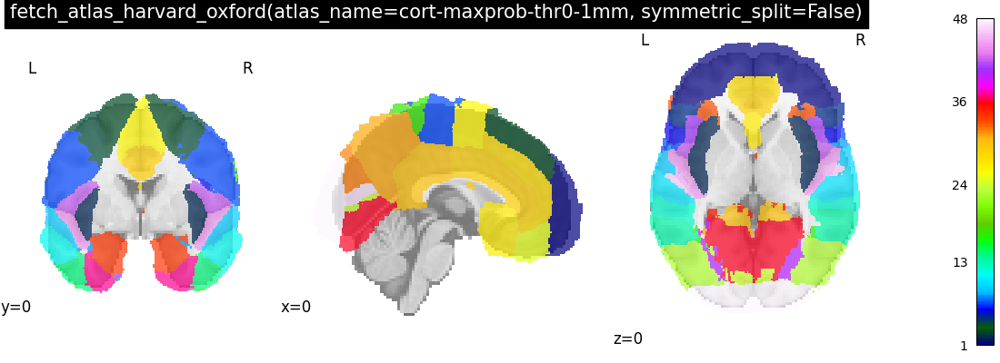
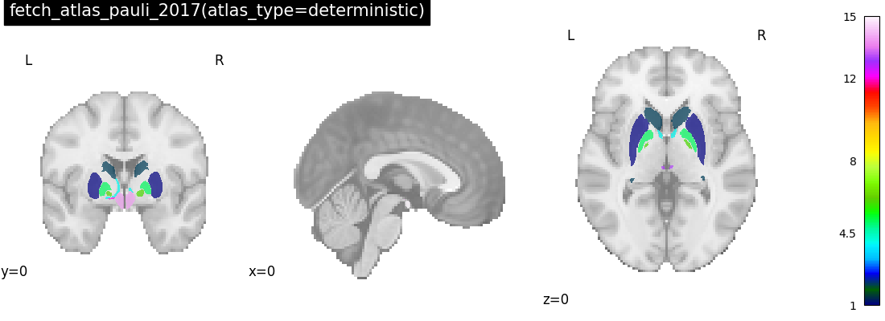

<!--
!!!!! DO NOT EDIT MANUALLY !!!!!
This file is auto-generated.
To modify the content of this file do it via the script:
make_atlas_table.py
-->
| name                        | template        | description                                     | image                                                                                                            |
|:----------------------------|:----------------|:------------------------------------------------|:-----------------------------------------------------------------------------------------------------------------|
| aal                         | MNI             | {ref}`description <aal_atlas>`                  |                                                                    |
| basc_multiscale_2015        | MNI152sym       | {ref}`description <basc_multiscale_2015_atlas>` |                         |
| destrieux_2009              | MNI?            | {ref}`description <destrieux_2009_atlas>`       |                                                         |
| harvard_oxford              | MNI152NLin6Asym | {ref}`description <harvard_oxford_atlas>`       |  |
| harvard_oxford(subcortical) | MNI152NLin6Asym | {ref}`description <harvard_oxford_atlas>`       |   |
| juelich                     | MNI?            | {ref}`description <juelich_atlas>`              |                                    |
| pauli_2017                  | MNI?            | {ref}`description <pauli_2017_atlas>`           |                                    |
| schaefer_2018               | MNI152NLin6Asym | {ref}`description <schaefer_2018_atlas>`        |                                                          |
| talairach                   | Talairach       | {ref}`description <talairach_atlas>`            |                                                |
| yeo_2011                    | fsaverage       | {ref}`description <yeo_2011_atlas>`             |                                 |
| destrieux_2009              | fsaverage       | {ref}`description <destrieux_2009_atlas>`       |                                                         |
