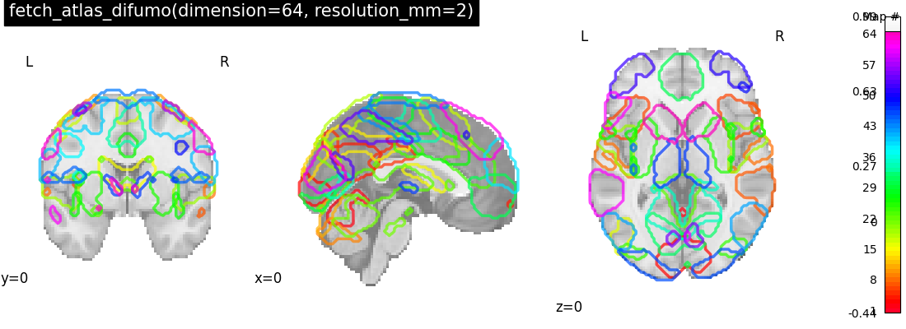
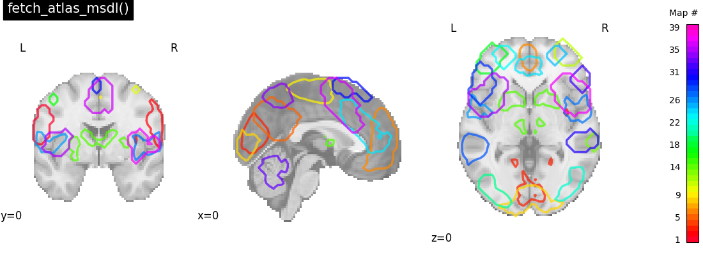

<!--
!!!!! DO NOT EDIT MANUALLY !!!!!
This file is auto-generated.
To modify the content of this file do it via the script:
make_atlas_table.py
-->
| name           | template        | description                               | image                                                                                                  |
|:---------------|:----------------|:------------------------------------------|:-------------------------------------------------------------------------------------------------------|
| allen_2011     | MNI152          | {ref}`description <allen_2011_atlas>`     |                                                    |
| craddock_2012  | MNI?            | {ref}`description <craddock_2012_atlas>`  |               |
| difumo         | MNI152NLin6Asym | {ref}`description <difumo_atlas>`         |                           |
| harvard_oxford | MNI152NLin6Asym | {ref}`description <harvard_oxford_atlas>` |                       |
| harvard_oxford | MNI152NLin6Asym | {ref}`description <harvard_oxford_atlas>` |  |
| juelich        | MNI?            | {ref}`description <juelich_atlas>`        |                                   |
| msdl           | MNI?            | {ref}`description <msdl_atlas>`           |                                                          |
| smith_2009     | MNI?            | {ref}`description <smith_2009_atlas>`     |                         |
