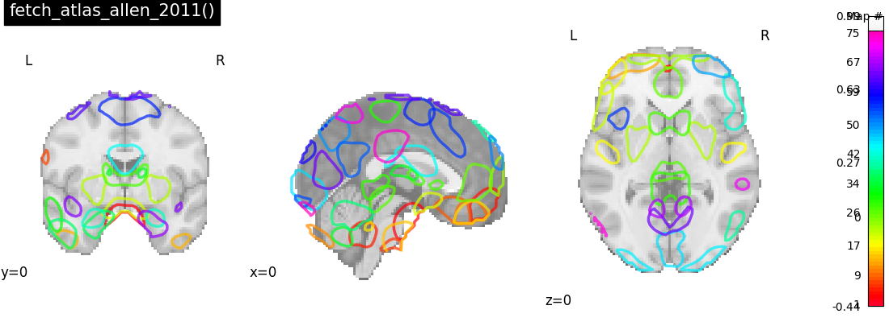
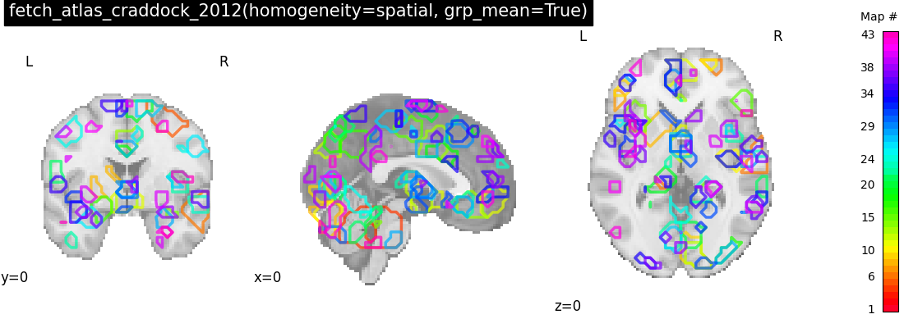
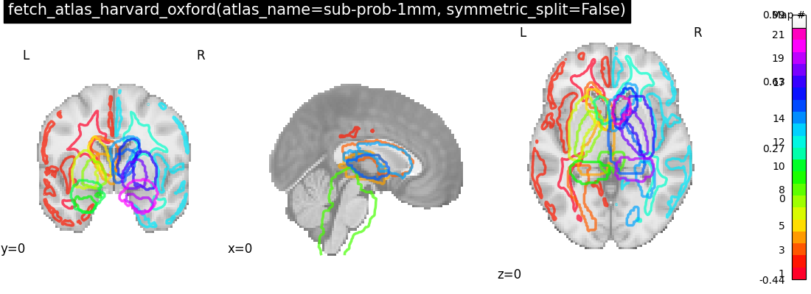
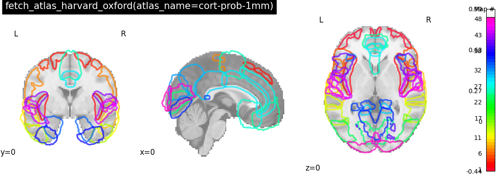
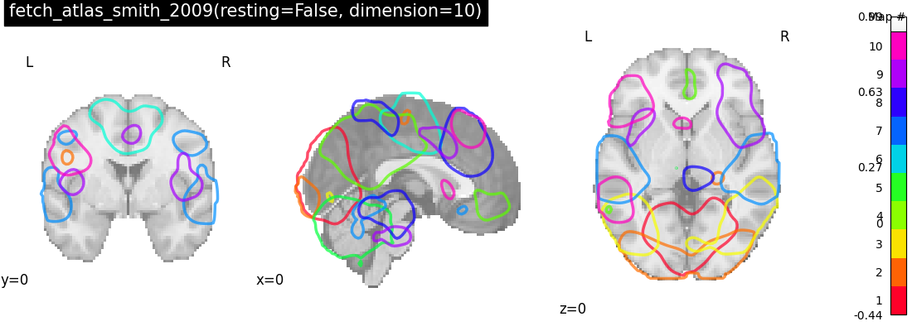

<!--
!!!!! DO NOT EDIT MANUALLY !!!!!
This file is auto-generated.
To modify the content of this file do it via the script:
make_atlas_table.py
-->

```{warning}
The atlases shipped with Nilearn
do not necessarily use the same MNI template
as the default MNI template used by Nilearn for plotting.

This may lead to atlas being poorly coregistered
to the underlay image used as underlay:
the atlas can appear smaller or bigger than the brain.

This can seen clearly on some of the images below.

You also should not use maskers with an atlas
that is not coregistered properly coregistered
with the images you want to extract data from
as this may lead to invalid results.
```

| name                                                                                                                                        | image                                                                                                  |
|:--------------------------------------------------------------------------------------------------------------------------------------------|:-------------------------------------------------------------------------------------------------------|
| **Allen (2011)**<br>*template*: MNI152<br>*number of regions*: 75<br>{ref}`description <allen_2011_atlas>`<br>                              |                                                    |
| **Craddock (2012)**<br>*template*: MNI?<br>*number of regions*: 43<br>{ref}`description <craddock_2012_atlas>`<br>                          |               |
| **Difumo**<br>*template*: MNI152NLin6Asym<br>*number of regions*: [64, 128, 256, 512, 1024]<br>{ref}`description <difumo_atlas>`<br>        |                           |
| **Harvard-Oxford (subcortical)**<br>*template*: MNI152NLin6Asym<br>*number of regions*: 21<br>{ref}`description <harvard_oxford_atlas>`<br> |  |
| **Harvard-Oxford**<br>*template*: MNI152NLin6Asym<br>*number of regions*: 48<br>{ref}`description <harvard_oxford_atlas>`<br>               |                       |
| **Juelich**<br>*template*: MNI?<br>*number of regions*: 62<br>{ref}`description <juelich_atlas>`<br>                                        |                                   |
| **MSDL**<br>*template*: MNI?<br>*number of regions*: 39<br>{ref}`description <msdl_atlas>`<br>                                              |                                                          |
| **Smith (2009)**<br>*template*: MNI?<br>*number of regions*: [10, 20, 70]<br>{ref}`description <smith_2009_atlas>`<br>                      |                         |
