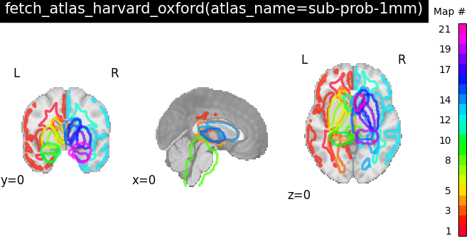
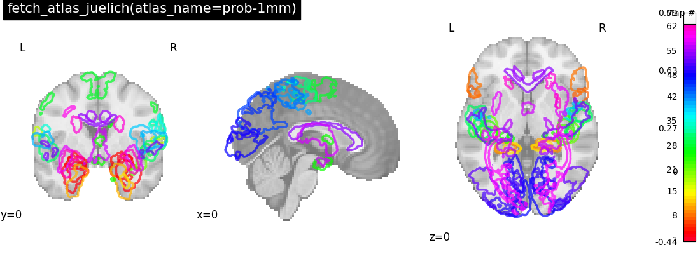
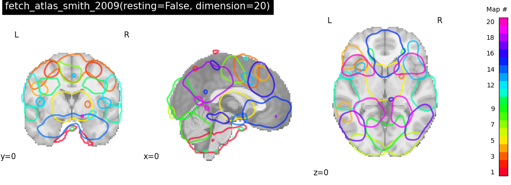

| name           | template   | description                               | image                                                                             |
|:---------------|:-----------|:------------------------------------------|:----------------------------------------------------------------------------------|
| allen_2011     | volume     | {ref}`description <allen_2011_atlas>`     |                               |
| harvard_oxford | volume     | {ref}`description <harvard_oxford_atlas>` |  |
| harvard_oxford | volume     | {ref}`description <harvard_oxford_atlas>` |   |
| juelich        | volume     | {ref}`description <juelich_atlas>`        |              |
| smith_2009     | volume     | {ref}`description <smith_2009_atlas>`     |    |
