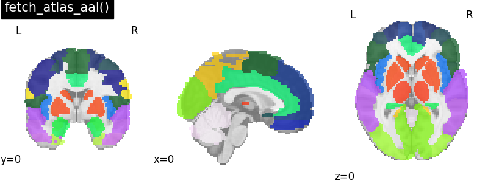
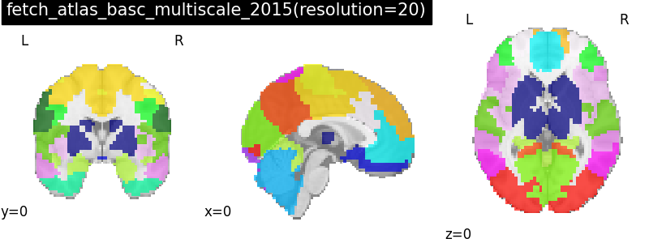
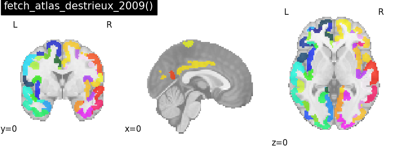
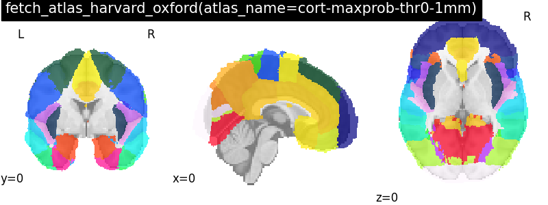
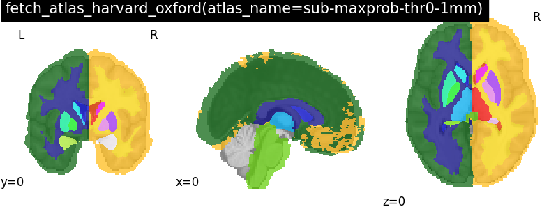
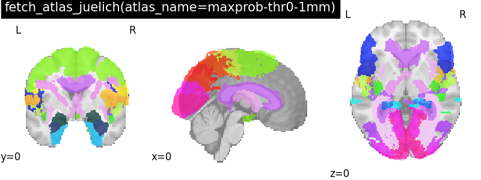
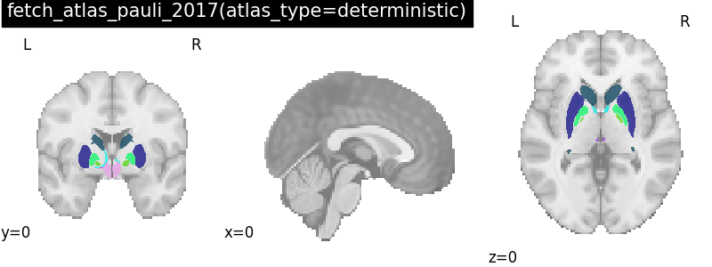
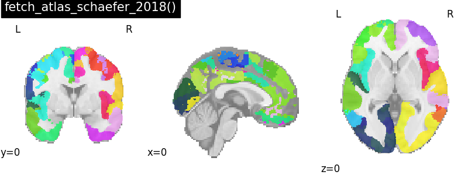
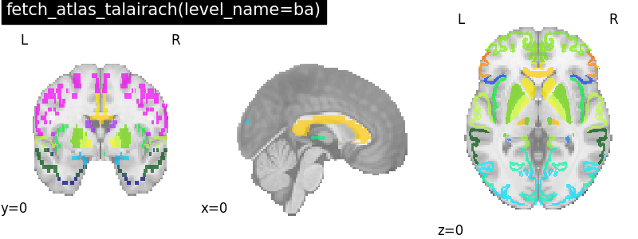
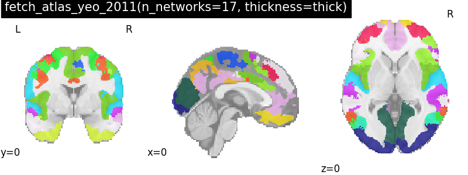

# Deterministic atlases

| name                 | template   | image                                                                  |
|:---------------------|:-----------|:-----------------------------------------------------------------------|
| aal                  | volume     |                                              |
| basc_multiscale_2015 | volume     |               |
| destrieux_2009       | volume     |                                   |
| harvard_oxford       | volume     |  |
| harvard_oxford       | volume     |   |
| juelich              | volume     |              |
| pauli_2017           | volume     |              |
| schaefer_2018        | volume     |                                    |
| talairach            | Talairach  |                          |
| yeo_2011             | fsaverage  |           |
