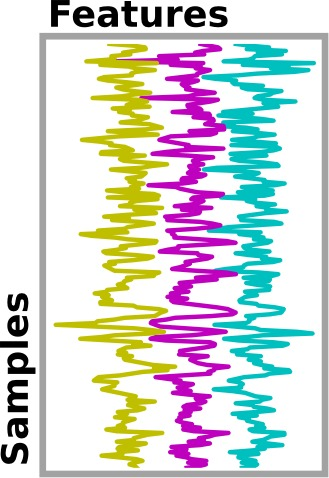

.. for doctests to run, we need to fetch the dataset
    >>> from nisl import datasets, utils
    >>> from nisl.io import NiftiMasker
    >>> dataset = datasets.fetch_haxby()

.. _getting_started:

================================================================================
Nifti Masker: getting started
================================================================================

.. currentmodule:: nisl.io.nifti_masker

Nisl is a package that aim to simplify the use of scikit-learn when dealing
with neuroimaging data. For the moment, Nisl is focused on functional MRI data,
as it is our area of expertise, but it is planned to open it to the whole
neuro-imaging field (EEG...).

At the heart of the package is the :class:`NiftiMasker`. It is is a kind of
*magic tool* that allows one to load data easily, to automatically preprocess
it and then to send it directly into a scikit-learn pipeline. It is designed
to apply some preprocessing steps by default with commonly used default
parameters. But it is *very important* to look at your data to see the effects
of these preprocessings and validate them.

In addition, the :class:`NiftiMasker` is a scikit-learn compliant transformer
so that you can directly plug it into a scikit-learn pipeline. This feature
can be seen in :ref:`nifti_masker_advanced`.

Nisl apply the following steps:

    1. :ref:`data_loading` : load Nifti files and check consistency of data
    2. :ref:`masking` : if a mask is not provided, computes one
    3. :ref:`resampling`
    4. :ref:`temporal_filtering`: detrending, confounds, normalization

.. _data_loading:

Data loading
============

The typical way to load data is to use a fetching function provided by Nisl
which will download a dataset and return a bunch of paths to the dataset
files. Each returned object is dataset specific. In fact there is no generic
dataset type in nisl: each dataset singularities are conserved. 

Loading neuroimaging data
-------------------------

The path to the files of the fetched dataset can then be passed directly to
the :class:`NiftiMasker`. There is no need to load it with nibabel: this will
be done automatically. This is the case of many functions in Nisl. They accept
what we call a *Nifti-like image* which can be a path to a Nifti file or a
python object that exposes the same interface as a Nifti image. This point will
be developped later.

For example :

.. literalinclude:: ../../plot_haxby_simple.py
    :start-after: ### Load haxby dataset ########################################################
    :end-before: ### Load Target labels ########################################################

We can now take a look at what Nisl loaded. It is only filenames referring to
dataset files on the disk::

  >>> dataset.keys()
  ['mask_house_little', 'anat', 'mask_house', 'mask_face', 'func', 'session_target', 'mask_vt', 'mask_face_little']
  >>> dataset.func # doctest: +ELLIPSIS
  ['.../haxby2001/subj1/bold.nii.gz']

.. note:: Custom data

   Please note that there are several ways to pass data to the Nifti Masker.
   You are not limited to the datasets proposed by nisl. Please take a look
   at :ref:`nifti_masker_advanced` to see how to use your own datasets or modify
   proposed dataset prior to passing them to the masker. 

Loading auxiliary data
----------------------

When you want to make an experiment, the pure neuroimaging data may not be the
only data you need. You may need additional information about subjects,
sessions or experiments. As said before, there is no generic python object for
dataset in Nisl (and most of the time, the format of these data does not
follow any standard) so one will have to load it *by hand*.

In the Haxby experiment, functional MRI data is acquired while presenting
different pictures to the subject. There are various types of features
(face, house...) and the goal of this experiment is to guess which picture is
presented to the subjects from his *brain activation*.

These conditions are presented as string into a CSV file. The numpy function
`loadtxt` is very useful to load this kind of data.

.. literalinclude:: ../../plot_haxby_simple.py
    :start-after: ### Load Target labels ########################################################
    :end-before: ### Remove resting state condition ############################################

If you are not conmfortable with this kind of data processing, do not worry:
there are plenty of example in Nisl that allows you to easilly load data from
provided dataset. Do not hesitate to copy/paste the code and adapt it to your
own data format if needed.

For example, we will now remove the *rest* condition from our dataset: in fact,
as we want to decode the image seen by the subject, we don't need data acquired
in resting state. This can be done as  this:

.. literalinclude:: ../../plot_haxby_simple.py
    :start-after: ### Remove resting state condition ############################################
    :end-before: ### Load and visualize the mask ###############################################

For more information on data loading and manipulation, please see:
:ref:`_downloading_data`

.. _masking:

Masking (fit)
=============

The main functionality of the Nifti Masker is obviously masking.
Masking consists in converting 4D data (3D volume over time) into 2D data
(voxels over time). This is very handy when manipulating data: 2D is
much simpler than 4D. Plus, getting rid of the *background* of the data
removes unuseful variables that may induce problems and increase computation
time.

Here is a typical 4 dimensional dataset:

.. figure:: ../images/niimgs.jpg
    :align: center
    :scale: 60%

That is converted into this kind of signal:

Additional information about masking can be found in :ref:`_mask_4d_2_3d`.

Mask Application
----------------

If your dataset provides a mask, the :class:`NiftiMasker` will apply it
automatically. All you have to do is to pass your mask as a parameter when
creating your masker:

.. literalinclude:: ../../plot_haxby_simple.py
    :start-after: ### Load and visualize the mask ###############################################
    :end-before: ### Preprocess data ###########################################################

You can see three important lines here:

    - the NiftiMasker creation
    - the call to the `fit` function (which loads the mask)
    - the recuperation of the mask into a variable (do not forget
      to convert your mask into a boolean otherwise you could get into
      serious trouble when applying it)

The other piece of code is only used to display the mask. We use an EPI slice
as a background and display the mask as a red overlay. We plan to provide
several tools in order to visualize data easilly. Any suggestions on this
feature are welcome !

.. figure:: ../auto_examples/images/plot_haxby_simple_1.png
    :target: ../auto_examples/plot_haxby_simple.html
    :align: center
    :scale: 50%

The great advantage of using the masker is that it can be
easily embedded in a scikit-learn pipeline.

Automatic Mask Computing
------------------------

If your dataset does not provide a mask, the Nifti masker will compute one
for you. This is done in the `fit` step of the transformer. The generated
mask can be accessed via the `mask_` member and visualized.

Detailed information on automatic mask computation can be found in:
:ref:`nifti_masker_advanced`.

Running default preprocessing (transform)
=========================================

The transformer is a classic scikit-learn transformer. You can invoke him
thanks to `fit` and `transform` methods or by a single call to `fit_transform`.

.. literalinclude:: ../../plot_haxby_simple.py
    :start-after: ### Preprocess data ###########################################################
    :end-before: ### Prediction function #######################################################

Processing: running SVC 
=======================

As a processing, we invoke scikit-learn Support Vector Classification.

.. literalinclude:: ../../plot_haxby_simple.py
    :start-after: ### Prediction function #######################################################
    :end-before: ### Unmasking #################################################################

We will not detail it here since there is a very good documentation about it in the
`scikit-learn documentation <http://scikit-learn.org/stable/modules/svm.html#classification>`__

Unmasking (inverse_transform)
=============================

Unmasking data is as easy as masking it! This can be done by using method `inverse_transform`
on your processed data. As you may want to unmask several kind of data (not only the data that
you previously masked but also the results of an algorithm), the masker is clever and can take
data of dimension 1D (resp. 2D) to convert it back to 3D (resp. 4D).

.. literalinclude:: ../../plot_haxby_simple.py
    :start-after: ### Unmasking #################################################################
    :end-before: ### Visualization #############################################################

Here we want to see the disciminating weights of some voxels.

Visualizing results
===================

Again the visualization code is simple. We can an fMRI slice as a background
and plot the weight. Brighter points have a higher discriminating weight.

.. literalinclude:: ../../plot_haxby_simple.py
    :start-after: ### Visualization #############################################################

.. figure:: ../auto_examples/images/plot_haxby_simple_2.png
    :target: ../auto_examples/plot_haxby_simple.html
    :align: center
    :scale: 50%

Going further
=============

Do you want to get the full potential of the Nifti Masker ? Take a look at the
advanced tutorial where you will learn to feed the masker with your own data
and tweak the parameters to get the best result !

:ref:`nifti_masker_advanced`
