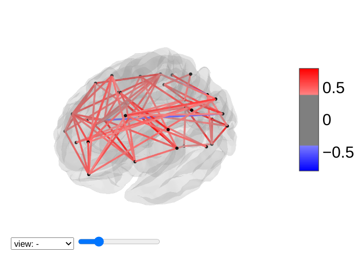
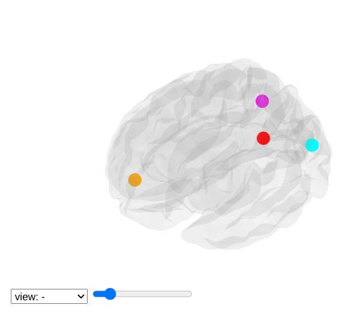

.. _plotting:

======================
Plotting brain images
======================

In this section, we detail the general tools to visualize
neuroimaging volumes with nilearn.

Nilearn comes with plotting function to display brain maps coming from
Nifti-like images, in the :mod:`nilearn.plotting` module.

.. contents:: **Contents**
    :local:
    :depth: 1

.. topic:: **Code examples**

   Nilearn has a whole section of the example gallery on plotting.

   A small tour of the plotting functions can be found in the example
   :ref:`sphx_glr_auto_examples_01_plotting_plot_demo_plotting.py`.

   Finally, note that, as always in the nilearn documentation, clicking
   on a figure will take you to the code that generates it.

.. currentmodule:: nilearn.plotting

Different plotting functions
=============================

Nilearn has a set of plotting functions to plot brain volumes that are
fined tuned to specific applications. Amongst other things, they use
different heuristics to find cutting coordinates.

.. |plot_stat_map| image:: ../auto_examples/01_plotting/images/sphx_glr_plot_demo_plotting_001.png
     :target: ../auto_examples/01_plotting/plot_demo_plotting.html
     :scale: 50

.. |plot_glass_brain| image:: ../auto_examples/01_plotting/images/sphx_glr_plot_demo_glass_brain_extensive_001.png
     :target: ../auto_examples/01_plotting/plot_demo_glass_brain_extensive.html
     :scale: 50

.. |plot_connectome| image:: ../auto_examples/03_connectivity/images/sphx_glr_plot_sphere_based_connectome_003.png
     :target: ../auto_examples/03_connectivity/plot_sphere_based_connectome.html
     :scale: 50

.. |plot_nodes| image:: ../auto_examples/03_connectivity/images/sphx_glr_plot_sphere_based_connectome_007.png
     :target: ../auto_examples/03_connectivity/plot_sphere_based_connectome.html
     :scale: 50

.. |plot_anat| image:: ../auto_examples/01_plotting/images/sphx_glr_plot_demo_plotting_003.png
     :target: ../auto_examples/01_plotting/plot_demo_plotting.html
     :scale: 50

.. |plot_roi| image:: ../auto_examples/01_plotting/images/sphx_glr_plot_demo_plotting_004.png
     :target: ../auto_examples/01_plotting/plot_demo_plotting.html
     :scale: 50

.. |plot_epi| image:: ../auto_examples/01_plotting/images/sphx_glr_plot_demo_plotting_005.png
     :target: ../auto_examples/01_plotting/plot_demo_plotting.html
     :scale: 50

.. |plot_prob_atlas| image:: ../auto_examples/01_plotting/images/sphx_glr_plot_prob_atlas_003.png
     :target: ../auto_examples/01_plotting/plot_prob_atlas.html
     :scale: 50

.. |plot_carpet| image:: ../auto_examples/01_plotting/images/sphx_glr_plot_carpet_001.png
     :target: ../auto_examples/01_plotting/plot_carpet.html
     :scale: 50

.. A temporary hack to avoid a sphinx bug
.. |hack| raw:: html

    

=================== =========================================================
=================== =========================================================
|plot_anat|          :func:`plot_anat`
                     |hack|
                     Plotting an anatomical image

|plot_epi|           :func:`plot_epi`
                     |hack|
                     Plotting an EPI, or T2* image

|plot_glass_brain|   :func:`plot_glass_brain`
                     |hack|
                     Glass brain visualization. By default plots maximum
                     intensity projection of the absolute values. To plot
                     positive and negative values set plot_abs parameter to
                     False.

|plot_stat_map|      :func:`plot_stat_map`
                     |hack|
                     Plotting a statistical map, like a T-map, a Z-map, or
                     an ICA, with an optional background

|plot_roi|           :func:`plot_roi`
                     |hack|
                     Plotting ROIs, or a mask, with an optional background

|plot_connectome|    :func:`plot_connectome`
                     |hack|
                     Plotting a connectome

                     Functions for automatic extraction of coords based on
                     brain parcellations useful for :func:`plot_connectome`
                     are demonstrated in
                     **Example:** :ref:`sphx_glr_auto_examples_03_connectivity_plot_atlas_comparison.py`

|plot_nodes|         :func:`plot_markers`
                     |hack|
                     Plotting network nodes (markers)

                     Function for automatic plotting of network nodes (markers) 
                     and color coding them according to provided nodal measure
                     (i.e. connection strength) as demonstrated in
                     **Example:** :ref:`sphx_glr_auto_examples_03_connectivity_plot_atlas_comparison.py`

|plot_prob_atlas|    :func:`plot_prob_atlas`
                     |hack|
                     Plotting 4D probabilistic atlas maps

|plot_carpet|        :func:`plot_carpet`
                     |hack|
                     Plotting voxel intensities across time.

**plot_img**         :func:`plot_img`
                     |hack|
                     General-purpose function, with no specific presets
=================== =========================================================

.. warning:: **Opening too many figures without closing**

   Each call to a plotting function creates a new figure by default. When
   used in non-interactive settings, such as a script or a program, these
   are not displayed, but still accumulate and eventually lead to slowing
   the execution and running out of memory.

   To avoid this, you must close the plot as follow::

    >>> from nilearn import plotting
    >>> display = plotting.plot_stat_map(img)     # doctest: +SKIP
    >>> display.close()     # doctest: +SKIP

|

.. seealso::

   :ref:`sphx_glr_auto_examples_01_plotting_plot_dim_plotting.py`

Different display modes
========================

.. |plot_ortho| image:: ../auto_examples/01_plotting/images/sphx_glr_plot_demo_more_plotting_001.png
     :target: ../auto_examples/01_plotting/plot_demo_more_plotting.html
     :scale: 50

.. |plot_z_many| image:: ../auto_examples/01_plotting/images/sphx_glr_plot_demo_more_plotting_002.png
     :target: ../auto_examples/01_plotting/plot_demo_more_plotting.html
     :scale: 30

.. |plot_x| image:: ../auto_examples/01_plotting/images/sphx_glr_plot_demo_more_plotting_003.png
     :target: ../auto_examples/01_plotting/plot_demo_more_plotting.html
     :scale: 50

.. |plot_y_small| image:: ../auto_examples/01_plotting/images/sphx_glr_plot_demo_more_plotting_004.png
     :target: ../auto_examples/01_plotting/plot_demo_more_plotting.html
     :scale: 50

.. |plot_z_small| image:: ../auto_examples/01_plotting/images/sphx_glr_plot_demo_more_plotting_005.png
     :target: ../auto_examples/01_plotting/plot_demo_more_plotting.html
     :scale: 50

.. |plot_xz| image:: ../auto_examples/01_plotting/images/sphx_glr_plot_demo_more_plotting_006.png
     :target: ../auto_examples/01_plotting/plot_demo_more_plotting.html
     :scale: 50

.. |plot_yx| image:: ../auto_examples/01_plotting/images/sphx_glr_plot_demo_more_plotting_007.png
     :target: ../auto_examples/01_plotting/plot_demo_more_plotting.html
     :scale: 50

.. |plot_yz| image:: ../auto_examples/01_plotting/images/sphx_glr_plot_demo_more_plotting_008.png
     :target: ../auto_examples/01_plotting/plot_demo_more_plotting.html
     :scale: 50

.. |plot_tiled| image:: ../auto_examples/01_plotting/images/sphx_glr_plot_demo_more_plotting_009.png
     :target: ../auto_examples/01_plotting/plot_demo_more_plotting.html
     :scale: 50

.. |plot_mosaic| image:: ../auto_examples/01_plotting/images/sphx_glr_plot_demo_more_plotting_010.png
     :target: ../auto_examples/01_plotting/plot_demo_more_plotting.html
     :scale: 30

.. |plot_lzr| image:: ../auto_examples/01_plotting/images/sphx_glr_plot_demo_glass_brain_extensive_006.png
     :target: ../auto_examples/01_plotting/plot_demo_glass_brain_extensive.html
     :scale: 50

.. |plot_lyrz| image:: ../auto_examples/01_plotting/images/sphx_glr_plot_demo_glass_brain_extensive_007.png
     :target: ../auto_examples/01_plotting/plot_demo_glass_brain_extensive.html
     :scale: 50

================= =========================================================
================= =========================================================
|plot_ortho|       `display_mode='ortho', cut_coords=[36, -27, 60]`
                   |hack|
                   Ortho slicer: 3 cuts along the x, y, z directions

|plot_z_many|      `display_mode='z', cut_coords=5`
                   |hack|
                   Cutting in the z direction, specifying the number of
                   cuts

|plot_x|           `display_mode='x', cut_coords=[-36, 36]`
                   |hack|
                   Cutting in the x direction, specifying the exact
                   cuts

|plot_y_small|     `display_mode='y', cut_coords=1`
                   |hack|
                   Cutting in the y direction, with only 1 cut, that is
                   automatically positionned

|plot_z_small|     `display_mode='z', cut_coords=1, colorbar=False`
                   |hack|
                   Cutting in the z direction, with only 1 cut, that is
                   automatically positionned

|plot_xz|          `display_mode='xz', cut_coords=[36, 60]`
                   |hack|
                   Cutting in the x and z direction, with cuts manually
                   positionned

|plot_yx|          `display_mode='yx', cut_coords=[-27, 36]`
                   |hack|
                   Cutting in the y and x direction, with cuts manually
                   positionned

|plot_yz|          `display_mode='yz', cut_coords=[-27, 60]`
                   |hack|
                   Cutting in the y and z direction, with cuts manually
                   positionned

|plot_tiled|       `display_mode='tiled', cut_coords=[36, -27, 60]`
                   |hack|
                   Tiled slicer: 3 cuts along the x, y, z directions,
                   arranged in a 2x2 grid

|plot_mosaic|      `display_mode='mosaic'`
                   |hack|
                   Mosaic slicer: multiple cuts along the x, y, z directions,
                   with cuts automatically positioned by default

|plot_lzr|         `Glass brain display_mode='lzr'`
                   |hack|
                   Glass brain and Connectome provide additional display modes
                   due to the possibility of doing hemispheric projections.
                   Check out: 'l', 'r', 'lr', 'lzr', 'lyr', 'lzry', 'lyrz'.

|plot_lyrz|        `Glass brain display_mode='lyrz'`
                   |hack|
                   Glass brain and Connectome provide additional display modes
                   due to the possibility of doing hemispheric projections.
                   Check out: 'l', 'r', 'lr', 'lzr', 'lyr', 'lzry', 'lyrz'.

================= =========================================================

Available Colormaps
===================

Nilearn plotting library ships with a set of extra colormaps, as seen in the
image below

.. image:: ../auto_examples/01_plotting/images/sphx_glr_plot_colormaps_001.png
     :target: ../auto_examples/01_plotting/plot_colormaps.html
     :scale: 50

These colormaps can be used as any other matplotlib colormap.

.. image:: ../auto_examples/01_plotting/images/sphx_glr_plot_colormaps_002.png
     :target: ../auto_examples/01_plotting/plot_colormaps.html
     :scale: 50

.. _display_modules:

Adding overlays, edges, contours, contour fillings, markers, scale bar
=======================================================================

To add overlays, contours, or edges, use the return value of the plotting
functions. Indeed, these return a display object, such as the
:class:`nilearn.plotting.displays.OrthoSlicer`. This object represents the
plot, and has methods to add overlays, contours or edge maps::

        display = plotting.plot_epi(...)

.. |plot_edges| image:: ../auto_examples/01_plotting/images/sphx_glr_plot_demo_more_plotting_010.png
     :target: ../auto_examples/01_plotting/plot_demo_more_plotting.html
     :scale: 50

.. |plot_contours| image:: ../auto_examples/01_plotting/images/sphx_glr_plot_demo_more_plotting_011.png
     :target: ../auto_examples/01_plotting/plot_demo_more_plotting.html
     :scale: 50

.. |plot_fill| image:: ../auto_examples/01_plotting/images/sphx_glr_plot_demo_more_plotting_012.png
     :target: ../auto_examples/01_plotting/plot_demo_more_plotting.html
     :scale: 50

.. |plot_markers| image:: ../auto_examples/01_plotting/images/sphx_glr_plot_demo_more_plotting_013.png
     :target: ../auto_examples/01_plotting/plot_demo_more_plotting.html
     :scale: 50

.. |plot_overlay| image:: ../auto_examples/01_plotting/images/sphx_glr_plot_overlay_002.png
     :target: ../auto_examples/01_plotting/plot_overlay.html
     :scale: 50

.. |plot_scalebar| image:: ../auto_examples/01_plotting/images/sphx_glr_plot_demo_more_plotting_014.png
     :target: ../auto_examples/01_plotting/plot_demo_more_plotting.html
     :scale: 50

================= =========================================================
================= =========================================================
|plot_edges|       `display.add_edges(img)`
                   |hack|
                   Add a plot of the edges of `img`, where edges are
                   extracted using a Canny edge-detection routine. This
                   is typically useful to check registration. Note that
                   `img` should have some visible sharp edges. Typically
                   an EPI img does not, but a T1 does.

|plot_contours|    `display.add_contours(img, levels=[.5], colors='r')`
                   |hack|
                   Add a plot of the contours of `img`, where contours
                   are computed for constant values, specified in
                   'levels'. This is typically useful to outline a mask,
                   or ROI on top of another map.
                   |hack|
                   **Example:** :ref:`sphx_glr_auto_examples_01_plotting_plot_haxby_masks.py`

|plot_fill|        `display.add_contours(img, filled=True, alpha=0.7, levels=[0.5], colors='b')`
                   |hack|
                   Add a plot of `img` with contours filled with colors

|plot_overlay|    `display.add_overlay(img, cmap=plotting.cm.purple_green, threshold=3)`
                  |hack|
                  Add a new overlay on the existing figure
                  |hack|
                  **Example:** :ref:`sphx_glr_auto_examples_01_plotting_plot_overlay.py`

|plot_markers|    `display.add_markers(coords, marker_color='y', marker_size=100)`
                  |hack|
                  Add seed based MNI coordinates as spheres on top of
                  statistical image or EPI image. This is useful for seed
                  based regions specific interpretation of brain images.
                  |hack|
                  **Example:** :ref:`sphx_glr_auto_examples_03_connectivity_plot_seed_to_voxel_correlation.py`

|plot_scalebar|   `display.annotate(scalebar=True)`
                  |hack|
                  Adds annotations such as a scale bar, or the cross of
                  the cut coordinates
                  |hack|
                  **Example:** :ref:`sphx_glr_auto_examples_01_plotting_plot_demo_more_plotting.py`

================= =========================================================

Displaying or saving to an image file
=====================================

To display the figure when running a script, you need to call
:func:`nilearn.plotting.show`: (this is just an alias to
:func:`matplotlib.pyplot.show`)::

    >>> from nilearn import plotting
    >>> plotting.show() # doctest: +SKIP

The simplest way to output an image file from the plotting functions is
to specify the `output_file` argument::

    >>> from nilearn import plotting
    >>> plotting.plot_stat_map(img, output_file='pretty_brain.png')     # doctest: +SKIP

In this case, the display is closed automatically and the plotting
function returns None.

|

The display object returned by the plotting function has a savefig method
that can be used to save the plot to an image file::

    >>> from nilearn import plotting
    >>> display = plotting.plot_stat_map(img)     # doctest: +SKIP
    >>> display.savefig('pretty_brain.png')     # doctest: +SKIP
    # Don't forget to close the display
    >>> display.close()     # doctest: +SKIP

.. _surface-plotting:

Surface plotting
================

Plotting functions required to plot surface data or statistical maps
on a brain surface.

.. versionadded:: 0.3

.. |plot_surf_roi| image:: ../auto_examples/01_plotting/images/sphx_glr_plot_surf_atlas_001.png
     :target: ../auto_examples/01_plotting/plot_surf_atlas.html
     :scale: 50

.. |plot_surf_stat_map| image:: ../auto_examples/01_plotting/images/sphx_glr_plot_surf_stat_map_001.png
     :target: ../auto_examples/01_plotting/plot_surf_stat_map.html
     :scale: 50

=====================   ===================================================================
=====================   ===================================================================
|plot_surf_roi|          :func:`plot_surf_roi`
                         |hack|
                         Plotting surface atlases on a brain surface
                         |hack|
                         **Example:**
                         :ref:`sphx_glr_auto_examples_01_plotting_plot_surf_atlas.py`

|plot_surf_stat_map|     :func:`plot_surf_stat_map`
                         |hack|
                         Plotting statistical maps onto a brain surface
                         |hack|
                         **Example:**
                         :ref:`sphx_glr_auto_examples_01_plotting_plot_surf_stat_map.py`

=====================   ===================================================================

.. _interactive-plotting:

Interactive plots
=================

Nilearn also has functions for making interactive plots that can be
seen in a web browser.

.. versionadded:: 0.5

   Interactive plotting is new in nilearn 0.5

For 3D surface plots of statistical maps or surface atlases, use
:func:`view_img_on_surf` and :func:`view_surf`. Both produce a 3D plot on the
cortical surface. The difference is that :func:`view_surf` takes as input a
surface map and a cortical mesh, whereas :func:`view_img_on_surf` takes as input
a volume statistical map, and projects it on the cortical surface before making
the plot.

For 3D plots of a connectome, use :func:`view_connectome`. To see only markers,
use :func:`view_markers`.

.. _interactive-surface-plotting:

3D Plots of statistical maps or atlases on the cortical surface
---------------------------------------------------------------

:func:`view_img_on_surf`: Surface plot using a 3D statistical map::

    >>> from nilearn import plotting, datasets     # doctest: +SKIP
    >>> img = datasets.fetch_localizer_button_task()['tmap']     # doctest: +SKIP
    >>> view = plotting.view_img_on_surf(img, threshold='90%', surf_mesh='fsaverage')     # doctest: +SKIP

If you are running a notebook, displaying ``view`` will embed an interactive
plot (this is the case for all interactive plots produced by nilearn's "view"
functions):

.. image:: ../images/plotly_surface_plot_notebook_screenshot.png

If you are not using a notebook, you can open the plot in a browser like this::

    >>> view.open_in_browser()     # doctest: +SKIP

This will open this 3D plot in your web browser:

.. image:: ../images/plotly_surface_plot.png

Or you can save it to an html file::

    >>> view.save_as_html("surface_plot.html")     # doctest: +SKIP

:func:`view_surf`: Surface plot using a surface map and a cortical mesh::

    >>> from nilearn import plotting, datasets     # doctest: +SKIP
    >>> destrieux = datasets.fetch_atlas_surf_destrieux()     # doctest: +SKIP
    >>> fsaverage = datasets.fetch_surf_fsaverage()     # doctest: +SKIP
    >>> view = plotting.view_surf(fsaverage['infl_left'], destrieux['map_left'],     # doctest: +SKIP
    ...                           cmap='gist_ncar', symmetric_cmap=False)     # doctest: +SKIP
    ...
    >>> view.open_in_browser()     # doctest: +SKIP

.. image:: ../images/plotly_surface_atlas_plot.png

.. _interactive-connectome-plotting:

3D Plots of connectomes
-----------------------

:func:`view_connectome`: 3D plot of a connectome::

      >>> view = plotting.view_connectome(correlation_matrix, coords, edge_threshold='90%')    # doctest: +SKIP
      >>> view.open_in_browser() # doctest: +SKIP

.. _interactive-markers-plotting:

3D Plots of markers
-------------------

:func:`view_markers`: showing markers (e.g. seed locations) in 3D::

    >>> from nilearn import plotting  # doctest: +SKIP
    >>> dmn_coords = [(0, -52, 18), (-46, -68, 32), (46, -68, 32), (1, 50, -5)] # doctest: +SKIP
    >>> view = plotting.view_markers( # doctest: +SKIP
    >>>       dmn_coords, ['red', 'cyan', 'magenta', 'orange'], marker_size=10) # doctest: +SKIP
    >>> view.open_in_browser() # doctest: +SKIP

.. _interactive-stat-map-plotting:

Interactive visualization of statistical map slices
---------------------------------------------------

:func:`view_img`: open stat map in a Brainsprite viewer (https://github.com/simexp/brainsprite.js)::

    >>> from nilearn import plotting, datasets     # doctest: +SKIP
    >>> img = datasets.fetch_localizer_button_task()['tmap']     # doctest: +SKIP
    >>> html_view = plotting.view_img(img, threshold=2, vmax=4, cut_coords=[-42, -16, 52],
    ...                                     title="Motor contrast")     # doctest: +SKIP

in a Jupyter notebook, if `html_view` is not requested, the viewer will be inserted in the notebook:

.. image:: ../images/view_img_screenshot_notebook.png

Or you can open a viewer in your web browser if you are not in a notebook::

    >>> html_view.open_in_browser()   # doctest: +SKIP

Finally, you can also save the viewer as a stand-alone html file::

    >>> html_view.save_as_html('viewer.html') # doctest: +SKIP
